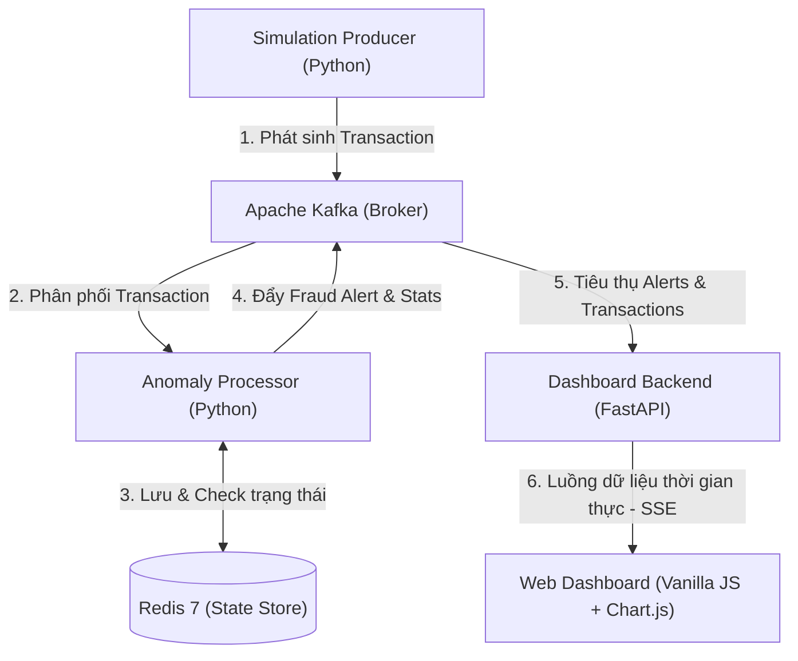

# Banking Transaction Anomaly Pipeline

Hệ thống phát hiện gian lận giao dịch ngân hàng thời gian thực (Real-time Fraud Detection System) sử dụng Apache Kafka làm trục truyền dẫn sự kiện, Python micro-batch stream processor làm động cơ phân tích luật, Redis lưu trữ trạng thái tần suất/vị trí địa lý, và bảng điều khiển (FastAPI + Server-Sent Events + Chart.js) để trực quan hóa thời gian thực.

---

## Kiến Trúc Hệ Thống (System Architecture)

Dự án được xây dựng theo mô hình Microservices phân tán hướng sự kiện (Event-driven Architecture). Luồng dữ liệu và tương tác giữa các dịch vụ được mô tả như sau:



### Thành phần & Luồng hoạt động:

1. **Producer**: Mô phỏng việc phát sinh hàng loạt giao dịch ngân hàng theo thời gian thực (với tần suất TPS tùy chỉnh). Dịch vụ này tự động gieo các mẫu giao dịch gian lận (như số tiền giao dịch bất thường, giao dịch trực tuyến số lượng lớn, giao dịch vào giờ đêm muộn, đối tác rủi ro cao, di chuyển phi thực tế) để kiểm thử hệ thống.
2. **Apache Kafka (Bitnami 3.6)**: Hoạt động ở chế độ KRaft (không cần ZooKeeper), gồm 3 topic chính:
   - `transactions` (4 partitions): Lưu trữ luồng giao dịch gốc từ Producer.
   - `fraud-alerts` (2 partitions): Lưu trữ các cảnh báo gian lận sau khi được phát hiện.
   - `tx-stats` (2 partitions): Lưu trữ các sự kiện thống kê hiệu suất luồng.
3. **Anomaly Processor**: Thành phần cốt lõi của hệ thống, xử lý luồng dữ liệu theo dạng vi lô (micro-batching, chu kỳ 1.0 giây). Nó tiêu thụ các tin nhắn từ topic `transactions`, chạy qua bộ luật phát hiện gian lận và tính toán điểm rủi ro (Risk Score) tổng hợp.
4. **Redis 7 (Alpine)**: Đóng vai trò bộ nhớ đệm trạng thái hiệu năng cao (In-Memory Key-Value store) lưu trữ dữ liệu lịch sử cửa sổ trượt (sliding-window):
   - Đếm tần suất giao dịch của tài khoản (`vel:<account_id>`) qua Redis Sorted Sets.
   - Theo dõi vị trí và thời điểm giao dịch cuối cùng của tài khoản (`geo:<account_id>`) để tính toán tốc độ di chuyển phi vật lý.
5. **Dashboard Backend (FastAPI)**: Kết nối tới Kafka, tiêu thụ các topic và sử dụng cơ chế Server-Sent Events (SSE) để truyền dữ liệu thời gian thực dạng luồng (non-blocking streaming data) tới Web UI.
6. **Web UI**: Giao diện trực quan hóa sinh động viết bằng HTML/CSS thuần (Glassmorphism design, Dark Mode) phối hợp với thư viện Chart.js để vẽ đồ thị phân bổ độ nghiêm trọng và số liệu cảnh báo thời gian thực.

---

## Công Nghệ Sử Dụng (Technology Stack)

| Thành phần               | Công nghệ             | Phiên bản      | Vai trò trong hệ thống                                                                    |
| :------------------------- | :---------------------- | :--------------- | :------------------------------------------------------------------------------------------- |
| **Message Broker**   | Apache Kafka            | 3.6 (KRaft)      | Trục truyền thông tin nhắn, đảm bảo truyền tải tin cậy, kháng lỗi                |
| **Stream Processor** | Python Core / PySpark   | 3.10+ / 3.5.0    | Động cơ phân tích luồng thời gian thực (Micro-batch / Structured Streaming)          |
| **State Store**      | Redis                   | 7.0-alpine       | Lưu trữ trạng thái giao dịch phục vụ cho các luật có trạng thái (Stateful rules) |
| **Web Backend**      | FastAPI                 | 0.111.0+         | Server phục vụ SSE (Server-Sent Events) và API thống kê                                 |
| **Frontend UI**      | HTML5 / CSS3 / Chart.js | Thuần (Vanilla) | Bảng điều khiển thời gian thực với thiết kế hiện đại, responsive                 |
| **Orchestration**    | Docker & Docker Compose | 3.9 spec         | Đóng gói và chạy môi trường độc lập một cách tự động                         |

---

## Quy Tắc Phát Hiện Gian Lận (Fraud Detection Rules)

Hệ thống tính điểm rủi ro (Risk Score) bằng cách cộng dồn điểm của tất cả các quy tắc bị kích hoạt. Mức độ nghiêm trọng tổng thể (Overall Severity) được xác định như sau:

* **CRITICAL**: Điểm rủi ro $\ge 80$
* **HIGH**: Điểm rủi ro từ $60$ đến $79$
* **MEDIUM**: Điểm rủi ro từ $35$ đến $59$
* **LOW**: Điểm rủi ro từ $1$ đến $34$
* **NONE**: Điểm rủi ro = $0$

Chi tiết các quy tắc được định nghĩa trong [processor/fraud_rules.py](./processor/fraud_rules.py):

#### 1. Quy tắc phi trạng thái (Stateless Rules)

Được kiểm tra trực tiếp trên từng giao dịch riêng lẻ mà không cần nhớ lịch sử:

* **`HIGH_AMOUNT`** (Số tiền quá lớn):
  - *Điều kiện kích hoạt*: Số tiền giao dịch $\ge \$5,000$.
  - *Mức độ*: **HIGH** (nếu $<\$20,000$) hoặc **CRITICAL** (nếu $\ge \$20,000$).
  - *Điểm số*: Tính động bằng $\min(100, \text{amount} / 500)$.
* **`CARD_NOT_PRESENT_HIGH`** (Giao dịch trực tuyến lớn):
  - *Điều kiện kích hoạt*: Giao dịch không dùng thẻ vật lý (`card_present` = False) và số tiền $\ge \$2,000$.
  - *Mức độ*: **HIGH**.
  - *Điểm số*: Cố định $60$.
* **`ODD_HOURS`** (Giao dịch giờ nhạy cảm):
  - *Điều kiện kích hoạt*: Giao dịch diễn ra trong khoảng thời gian từ **02:00 đến 05:00 UTC**.
  - *Mức độ*: **MEDIUM**.
  - *Điểm số*: $30$.
* **`ROUND_NUMBER`** (Số tiền làm tròn):
  - *Điều kiện kích hoạt*: Số tiền giao dịch là một trong các giá trị chẵn tròn: $\$100$, $\$500$, $\$1,000$, $\$2,000$, $\$5,000$, $\$10,000$.
  - *Mức độ*: **LOW**.
  - *Điểm số*: $20$.
* **`HIGH_RISK_MERCHANT`** (Đối tác rủi ro cao):
  - *Điều kiện kích hoạt*: Giao dịch thuộc danh mục kinh doanh rủi ro cao: `wire_transfer` (chuyển khoản quốc tế), `crypto` (tiền mã hóa), `gambling` (cờ bạc), `unknown` (đối tác lạ).
  - *Mức độ*: **MEDIUM**.
  - *Điểm số*: $40$.

#### 2. Quy tắc có trạng thái (Stateful Rules)

Đại diện cho các hành vi liên quan tới chuỗi giao dịch liên tiếp và đòi hỏi truy vấn dữ liệu lịch sử được lưu trữ tại Redis:

* **`VELOCITY`** (Tần suất giao dịch dày đặc):
  - *Mô tả*: Người dùng thực hiện quá nhiều giao dịch trong thời gian rất ngắn (dấu hiệu thẻ bị hack và quét hàng loạt).
  - *Điều kiện kích hoạt*: Có **nhiều hơn 6 giao dịch** của cùng một tài khoản phát sinh trong cửa sổ trượt **10 phút** (600 giây).
  - *Cơ chế kỹ thuật*: Sử dụng cấu trúc dữ liệu **Redis Sorted Sets (ZADD, ZREMRANGEBYSCORE, ZCARD)** để thêm giao dịch mới, loại bỏ các giao dịch cũ ngoài cửa sổ 10 phút, và đếm số lượng giao dịch còn lại.
  - *Mức độ*: **HIGH**.
  - *Điểm số*: $70$.
* **`GEO_VELOCITY`** (Tốc độ di chuyển phi thực tế - Impossible Travel):
  - *Mô tả*: Hai giao dịch liên tiếp của cùng một tài khoản được thực hiện ở các khoảng cách quá xa nhau trong thời gian quá ngắn mà vật lý thông thường không cho phép (ví dụ: rút tiền ở New York và 10 phút sau ở London).
  - *Điều kiện kích hoạt*: Hai giao dịch cách nhau dưới **30 phút** (1,800 giây) nhưng có khoảng cách địa lý $\ge 400$ km.
  - *Cơ chế kỹ thuật*: Tính khoảng cách bề mặt Trái Đất giữa hai tọa độ (Latitude/Longitude) theo công thức **Haversine**. Vị trí và thời gian giao dịch trước đó được lưu và cập nhật liên tục tại Redis bằng khóa `geo:<account_id>` với TTL 60 phút.
  - *Mức độ*: **CRITICAL**.
  - *Điểm số*: $90$.

---

## Hướng Dẫn Vận Hành & Khởi Chạy (Docker Quick Start)

Hệ thống được đóng gói hoàn chỉnh bằng Docker Compose, giúp triển khai tức thời trên mọi môi trường.

### 1. Khởi chạy toàn bộ hệ thống

Sử dụng lệnh sau để tự động build mã nguồn, tạo mạng nội bộ và chạy các containers ở chế độ ngầm (detached mode):

```bash
docker compose up --build -d
```

*Hoặc sử dụng Makefile:*

```bash
make up
```

Sau khi toàn bộ dịch vụ khởi chạy thành công:

* **Web Dashboard**: Truy cập tại 👉 **[http://localhost:8080](http://localhost:8080)** để theo dõi luồng giao dịch và cảnh báo thời gian thực.

### 2. Theo dõi logs hệ thống

Để kiểm tra logs thời gian thực của quá trình mô phỏng, phát hiện gian lận và hoạt động dashboard:

```bash
# Theo dõi logs tất cả các dịch vụ
docker compose logs -f

# Hoặc chỉ xem logs của một số thành phần chính (Producer, Processor, Dashboard)
docker compose logs -f producer processor dashboard
```

*Hoặc sử dụng Makefile:*

```bash
make logs
```

### 3. Tạm dừng hệ thống

Để dừng các container nhưng vẫn giữ nguyên cấu trúc lưu trữ và dữ liệu hiện tại trong Kafka và Redis:

```bash
docker compose down
```

*Hoặc sử dụng Makefile:*

```bash
make down
```

### 4. Dọn dẹp sạch dữ liệu (Clean Reset)

Nếu bạn muốn tắt toàn bộ hệ thống, xóa sạch các container, network nội bộ, và xóa toàn bộ dữ liệu lưu trong các Docker Volume (reset hoàn toàn Kafka, Redis về trạng thái ban đầu):

```bash
docker compose down -v --remove-orphans
```

*Hoặc sử dụng Makefile:*

```bash
make clean
```

## Công cụ Makefile tiện ích

Hệ thống đi kèm một `Makefile` giúp đơn giản hóa các thao tác quản trị:

| Lệnh                      | Chi tiết công việc                                                                                        |
| :------------------------- | :----------------------------------------------------------------------------------------------------------- |
| `make up`                | Khởi dựng và chạy nền toàn bộ hệ thống                                                              |
| `make down`              | Tắt các containers (giữ lại dữ liệu)                                                                   |
| `make logs`              | Theo dõi logs trực tiếp từ Producer, Processor, Dashboard                                                |
| `make clean`             | Dừng hệ thống và xóa sạch toàn bộ volumes dữ liệu                                                  |
| `make restart-processor` | Khởi động lại dịch vụ xử lý (Processor) để cập nhật code luật mới                              |
| `make topics`            | Liệt kê danh sách các topic hiện có trên Kafka                                                        |
| `make tail-alerts`       | Kết nối trực tiếp vào Kafka container để xem luồng tin nhắn cảnh báo trong topic `fraud-alerts` |

---

## Triển khai sản xuất với PySpark (PySpark Deployment)

Dự án cung cấp một mã nguồn xử lý luồng sản xuất hoàn chỉnh dựa trên **PySpark Structured Streaming** tại đường dẫn [processor/spark_detector.py](./processor/spark_detector.py).

Để chạy mã này trên cụm Spark (Spark Cluster), sử dụng lệnh `spark-submit` với Kafka connector package thích hợp:

```bash
spark-submit \
  --packages org.apache.spark:spark-sql-kafka-0-10_2.12:3.5.0 \
  processor/spark_detector.py
```

> [!NOTE]
> Các luật tính toán phi trạng thái được tối ưu hóa trực tiếp trên Spark DataFrames. Đối với các luật có trạng thái phức tạp (như Velocity hoặc Geo-Velocity), code Spark sử dụng hàm `foreachBatch` để tích hợp ghi và đọc trạng thái hiệu năng cao từ Redis một cách hiệu quả, tránh nghẽn cổ chai ghi trực tiếp.
>
> *Lưu ý*: Có một sự khác biệt nhỏ về phân cấp mức độ nghiêm trọng giữa tệp Spark và tệp Python Core. Ở phiên bản Spark UDF (`spark_detector.py`), quy tắc `HIGH_AMOUNT` luôn gán mức `HIGH` cho mọi giao dịch $\ge \$5,000$, trong khi bản gốc Python phân cấp thêm mức `CRITICAL` nếu giao dịch $\ge \$20,000$.

---

## Khuyến nghị Bảo mật & Triển khai Sản xuất (Security & Production Recommendations)

Qua kiểm tra bảo mật dự án (Security Audit), dưới đây là một số khuyến nghị quan trọng khi chuyển giao từ môi trường phát triển (Development) sang môi trường sản xuất (Production):

1. **Mật khẩu truy cập Redis (Redis Authentication)**:
   - Trong `docker-compose.yml`, dịch vụ Redis hiện tại không cài đặt mật khẩu (`requirepass`) và mở cổng công khai `6379`. Điều này tiềm ẩn nguy cơ rò rỉ dữ liệu vị trí giao dịch (`geo:<account_id>`) hoặc lịch sử của khách hàng.
   - *Khuyến nghị*: Loại bỏ mapping `ports: ["6379:6379"]` khỏi tệp Compose nếu không cần thiết phải truy cập Redis từ bên ngoài máy chủ. Sử dụng cấu hình `--requirepass` để mã hóa kết nối giữa Processor và Redis.
2. **Mã hóa và xác thực Kafka**:
   - Hiện tại Kafka sử dụng kết nối không mã hóa `PLAINTEXT` trên cổng `9092` và `9094` với tham số `ALLOW_PLAINTEXT_LISTENER=yes`.
   - *Khuyến nghị*: Không mở cổng `9092` ra ngoài host. Trong môi trường production, hãy cấu hình xác thực SASL và sử dụng giao thức `SASL_SSL` để mã hóa luồng dữ liệu trên đường truyền, tránh bị bắt gói tin (packet sniffing).
3. **Quản lý thông tin nhạy cảm**:
   - Tuyệt đối không đưa tệp tin `.env` chứa mật khẩu thực tế lên hệ thống quản lý mã nguồn Git (đảm bảo tệp `.env` luôn nằm trong `.gitignore`).

---

## Kiểm thử & Phân tích chất lượng (Testing & Quality Analysis)

### 1. Cơ chế kiểm thử hiện tại

* **Kiểm thử vận hành (Operational Verification)**: Hệ thống hiện tại sử dụng cơ chế kiểm thử dựa trên log và giao diện trực quan thời gian thực.
  - Trình mô phỏng `producer` sinh ngẫu nhiên các giao dịch bất thường (anomaly seeding) sau mỗi vài giây.
  - `processor` xử lý luồng, in kết quả phát hiện ra thiết bị đầu cuối (`console logs`).
  - `dashboard` kết nối và hiển thị biểu đồ phân bổ thời gian thực.

### 2. Sự không nhất quán về cấu hình cần lưu ý

* **Topic Giao dịch (`INPUT_TOPIC` và `TRANSACTIONS_TOPIC`)**:
  - Dịch vụ sinh dữ liệu (`producer`) và bảng điều khiển (`dashboard`) cấu hình biến `TRANSACTIONS_TOPIC` trong môi trường Docker.
  - Tuy nhiên, dịch vụ xử lý luồng (`processor`) nhận diện luồng giao dịch đầu vào thông qua biến `INPUT_TOPIC`.
  - Mặc định cả hai đều trỏ về topic `"transactions"`. Nếu bạn thay đổi tên topic giao dịch trong tệp cấu hình `.env`, hãy đảm bảo cập nhật đồng bộ cả hai biến trên.

### 3. Đề xuất phát triển bộ kiểm thử tự động (Automated Test Suite)

Để tránh các lỗi logic tiềm ẩn khi nâng cấp code luật phát hiện gian lận, dự án được đề xuất xây dựng thêm bộ kiểm thử tự động với `pytest` và `fakeredis` để kiểm thử:

* **Kiểm thử đơn vị các quy tắc phi trạng thái (Stateless Unit Tests)**: Truyền các payload giả lập để khẳng định `HIGH_AMOUNT`, `CARD_NOT_PRESENT_HIGH`, `ODD_HOURS`, `ROUND_NUMBER`, `HIGH_RISK_MERCHANT` hoạt động đúng.
* **Kiểm thử có trạng thái (Stateful Mock Tests)**: Sử dụng mock Redis để giả lập luồng ghi đè toạ độ địa lý và khẳng định luật `GEO_VELOCITY` phát hiện chính xác khoảng cách di chuyển phi vật lý.

---

## Cấu Hình Môi Trường (Configuration)

Các biến môi trường cấu hình hệ thống nằm trong tệp tin `.env`. Bạn có thể sao chép từ tệp mẫu `.env.example` và tùy chỉnh:

```bash
cp .env.example .env
```

### Các tham số cấu hình chính:

| Tên biến                  | Giá trị mặc định | Giải thích ý nghĩa                                                                                                    |
| :-------------------------- | :-------------------- | :------------------------------------------------------------------------------------------------------------------------ |
| `TPS`                     | `5`                 | Tần suất sinh giao dịch của Producer (Transactions Per Second). Tăng giá trị để kiểm tra hiệu năng hệ thống |
| `KAFKA_BOOTSTRAP_SERVERS` | `kafka:9092`        | Địa chỉ máy chủ bootstrap của Apache Kafka                                                                          |
| `REDIS_HOST`              | `redis`             | Tên host dịch vụ Redis lưu trữ trạng thái                                                                          |
| `REDIS_PORT`              | `6379`              | Cổng kết nối dịch vụ Redis                                                                                           |
| `TRANSACTIONS_TOPIC`      | `transactions`      | Topic lưu trữ luồng giao dịch gốc (sử dụng bởi producer và dashboard)                                            |
| `INPUT_TOPIC`             | `transactions`      | Topic đầu vào của bộ xử lý (sử dụng bởi processor)                                                              |
| `ALERTS_TOPIC`            | `fraud-alerts`      | Topic lưu trữ luồng cảnh báo gian lận                                                                               |
| `STATS_TOPIC`             | `tx-stats`          | Topic lưu trữ số liệu thống kê hiệu năng                                                                          |

---

## Sơ Đồ Thư Mục Dự Án (Project Layout)

Cấu trúc mã nguồn của dự án được bố trí khoa học:

```
BDA_Final_SBDA-SA/
├── docker-compose.yml        # Định nghĩa điều phối Docker cho toàn bộ stack
├── Makefile                  # Các lệnh điều khiển hệ thống nhanh
├── README.md                 # Tài liệu hướng dẫn sử dụng và thuyết minh dự án
├── LICENSE                   # Tệp tin giấy phép bản quyền MIT
├── .env.example              # Tệp cấu hình môi trường mẫu
├── .gitignore                # Khai báo các tệp loại trừ khỏi Git
├── docs/                     # Tài liệu thiết kế hệ thống chuyên sâu
│   ├── UTH_Report_Template.docx
│   ├── UTH_Report_Template.json
│   ├── report.pdf            # Báo cáo PDF chuyên sâu về dự án
│   ├── retail.md             # Báo cáo phân tích chuyên sâu về hệ thống
│   └── slide.pdf             # Slide thuyết trình dự án
├── producer/                 # Dịch vụ sinh dữ liệu giả lập (Transaction Producer)
│   ├── transaction_producer.py
│   └── Dockerfile
├── processor/                # Dịch vụ xử lý luồng & phát hiện gian lận (Anomaly Detector)
│   ├── anomaly_detector.py   # Code chạy chính trong Docker (Python micro-batch)
│   ├── spark_detector.py     # Code triển khai qua PySpark Structured Streaming
│   ├── fraud_rules.py        # Logic nghiệp vụ các luật phát hiện gian lận
│   └── Dockerfile
└── dashboard/                # Dịch vụ giao diện giám sát (FastAPI + Client UI)
    ├── app.py                # Server FastAPI phục vụ API thống kê và SSE
    ├── static/
    │   └── index.html        # Giao diện giám sát thời gian thực (Vanilla JS + Chart.js)
    └── Dockerfile
```

---

## Giấy Phép Bản Quyền (License)

Dự án được phân phối dưới dạng phần mềm mã nguồn mở tuân thủ các điều khoản của **[MIT License](./LICENSE)**.

Xem toàn văn tệp tin giấy phép tại **[LICENSE](./LICENSE)**.

---

*Bản quyền hình ảnh và thiết kế giao diện thuộc về H. THE HY. Dự án phục vụ mục tiêu học tập và nghiên cứu hệ thống phân tán thời gian thực.*
